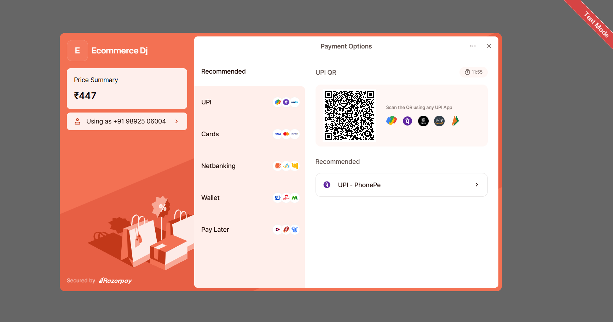

# Django E-commerce Website with Razorpay Integration

A robust e-commerce platform built with Django, featuring secure payments through Razorpay, automated email invoicing, and a responsive Bootstrap UI.


## 🚀 Features

- **Product Management**
    - Category-wise product display
    - Product search and filtering
    - Detailed product views with images
    - Stock management

- **Order Processing**
    - Shopping cart functionality
    - Order tracking system
    - Email notifications
    - PDF invoice generation

- **Payment Integration**
    - Secure Razorpay payment gateway
    - Multiple payment methods
    - Transaction status tracking

- **User Management**
    - User registration and authentication
    - Order history
    - Profile management
    - Address book

## 💻 Tech Stack

- Django 4.2+
- Python 3.8+
- Bootstrap 5
- SQLite/
- Razorpay API
- Django Template Engine

## 📸 Screenshots


*Admin Dashboard with Filtering Options*


*Checkout Process*


*Razorpay Payment Page*


*Email Invoice*

## ⚙️ Installation

1. Clone the repository:
```bash
git clone https://github.com/mohdali03/ecommerce-django.git
cd ecommercedj
```

2. Create virtual environment:
```bash
python -m venv venv
source venv/bin/activate  # Linux/Mac
venv\Scripts\activate     # Windows
```

3. Install dependencies:
```bash
pip install -r requirements.txt
```

4. Configure environment variables:
```bash
cp .env.example .env
# Update .env with your settings
```

5. Apply migrations:
```bash
python manage.py migrate
```

6. Create superuser:
```bash
python manage.py createsuperuser
```

7. Run the server:
```bash
python manage.py runserver
```

## 🔧 Configuration

### Razorpay Setup
```python
RAZORPAY_KEY_ID = 'your_key_id'
RAZORPAY_KEY_SECRET = 'your_key_secret'
```

### Email Configuration
```python
EMAIL_BACKEND = 'django.core.mail.backends.smtp.EmailBackend'
EMAIL_HOST = 'smtp.gmail.com'
EMAIL_PORT = 587
EMAIL_USE_TLS = True
EMAIL_HOST_USER = 'your_email@gmail.com'
EMAIL_HOST_PASSWORD = 'your_app_password'
```

## 📝 Contributing

Pull requests are welcome. For major changes, please open an issue first to discuss what you would like to change.

## 📄 License

This project is licensed under the MIT License - see the [LICENSE](LICENSE) file for details.

## 🙏 Acknowledgments

- Django Documentation
- Razorpay API Documentation
- Bootstrap Team
- Contributors and Testers

## 📞 Contact

For any queries or support, please contact:
- Email: your.email@example.com
- LinkedIn: [Your Name](https://linkedin.com/in/yourprofile)

---
*Note: Replace placeholder images and credentials with actual content before deployment.*